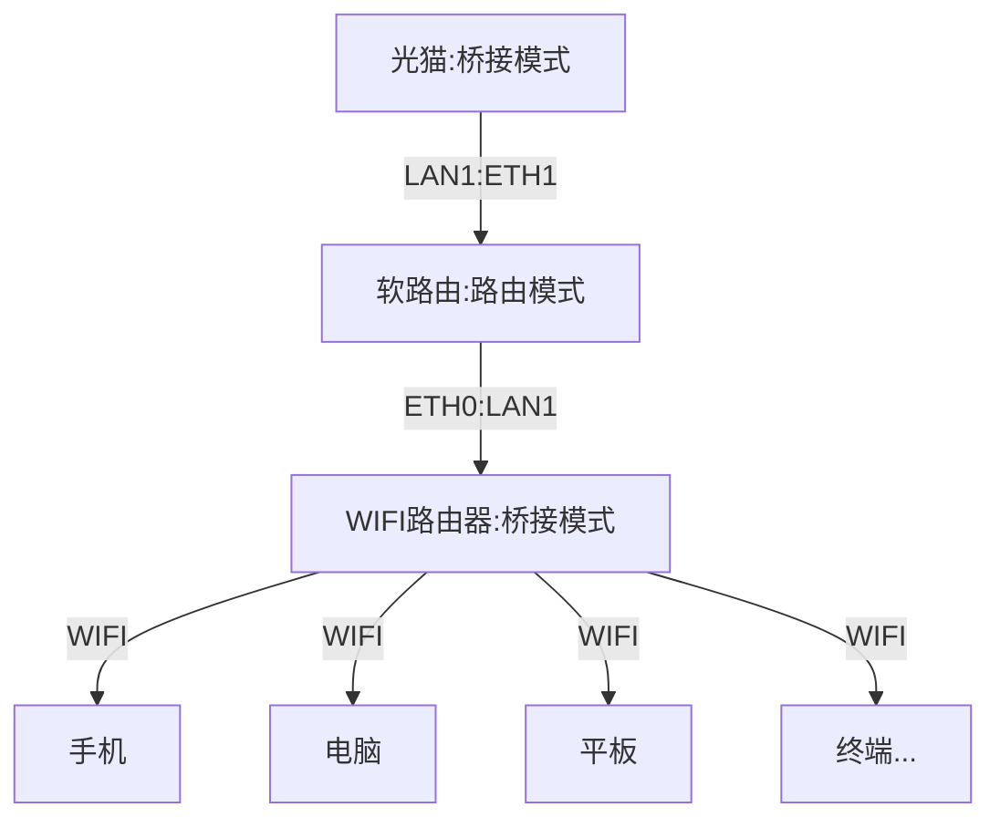
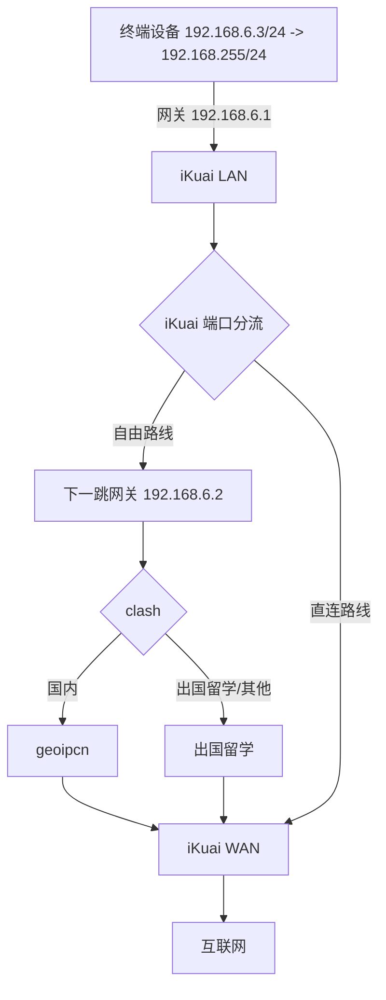
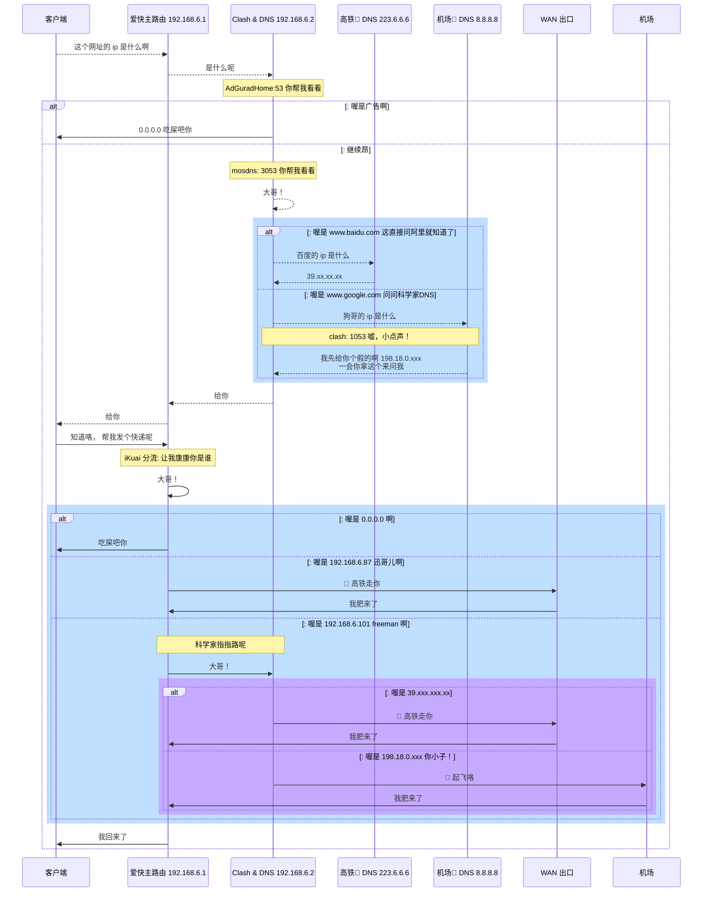

# BoomLab

> 折腾记录，分享给大家也方便自己回头找

**iKuai 「×」 clash 实现自然丝滑的分流体验;**

**基于绿色节能 ~~至少理论上~~ LXC 容器技术，最大化的利用 CPU/内存资源 搭建 NAS 应用; 同时实现了应用分层管理，加上快照可以随意折腾**


## 整体思路

科学部分:

- iKuai 主路由: 简单好用的管理后台，优雅的分流配置
- LXC 旁路由： AdGuardHome 「×」 mosdns 「×」 ShellClash 自然丝滑的分流体验

LXC 容器部分:

- 网盘小鸡： FTP/SFTP/WebDav/AList
- Docker 小鸡： 套娃 docker
- 电视鸡： jellyfin
- 下载鸡： qBittorrent 「×」 NAS 迅雷

宿主机:

- tailscale 外网访问

## 硬件配置

USB 3.2 外挂 16TB 单机械硬盘, 主机配置如下：

```sh
root@pve
--------
OS: Proxmox VE 8.0.3 x86_64
Host: EHL30 V1.0
Kernel: 6.2.16-3-pve
Uptime: 10 hours, 3 mins
Packages: 1315 (dpkg)
Shell: zsh 5.9
Terminal: /dev/pts/0
CPU: Intel Celeron J6412 (4) @ 2.600GHz
GPU: Intel Elkhart Lake [UHD Graphics Gen11 16EU]
Memory: 2557MiB / 7777MiB
```

## 科学核心

### 硬件拓扑

:::tip 物理接口， ~~划线~~ 代表未使用

1.光猫: LAN1, ~~LAN2~~, ~~LAN3~~, ~~LAN4~~

2.软路由: ETH1, ETH2

3.WIFI 硬路由: WIFI, ~~LAN1~~, ~~LAN2~~, ~~LAN3~~, ~~LAN4~~, ~~WAN1~~
:::

| 名称    | 入口   | 出口   | 路由模式 |
| ------- | ------ | ------ | -------- |
| 光猫    | 光纤   | `LAN1` | 桥接     |
| 软路由  | `ETH1` | `ETH0` | 路由     |
| TP-Link | `LAN1` | `WIFI` | 桥接     |



### 分流策略

:::tip 分流策略

1. 自由路线 192.168.6.3 - 192.168.6.200

2. 直连路线 192.168.6.201 - 192.168.6.255

:::

### 网络拓扑



#### 科学详解

[查看大图](http://mermaid-plugin.tooltag.cn/view/#eyJjb2RlIjoic2VxdWVuY2VEaWFncmFtXG4gIHBhcnRpY2lwYW50IEEgYXMg5a6i5oi356uvXG4gIHBhcnRpY2lwYW50IEIgYXMg54ix5b-r5Li76Lev55SxIDE5Mi4xNjguNi4xXG4gIHBhcnRpY2lwYW50IEMgYXMgQ2xhc2ggJiBETlMgMTkyLjE2OC42LjJcbiAgcGFydGljaXBhbnQgRjEgYXMg6auY6ZOB8J-ahCBETlMgMjIzLjYuNi42XG4gIHBhcnRpY2lwYW50IEYyIGFzIOacuuWcuvCfm6sgRE5TIDguOC44LjhcbiAgcGFydGljaXBhbnQgRSBhcyBXQU4g5Ye65Y-jXG4gIHBhcnRpY2lwYW50IEQgYXMg5py65Zy6XG4gIEEgLS0-PiBCOiDov5nkuKrnvZHlnYDnmoQgaXAg5piv5LuA5LmI5ZWKXG4gIEIgLS0-PiBDOiDmmK_ku4DkuYjlkaJcbiAgTm90ZSBvdmVyIEMsQzogQWRHdXJhZEhvbWU6NTMg5L2g5biu5oiR55yL55yLXG4gIGFsdDog5ZaU5piv5bm_5ZGK5ZWKXG4gICAgQyAtPj4gQTogMC4wLjAuMCDlkIPlsY7lkKfkvaBcbiAgZWxzZTog57un57ut5piCXG4gIE5vdGUgb3ZlciBDLEM6IG1vc2RuczogMzA1MyDkvaDluK7miJHnnIvnnItcbiAgQyAtLT4-IEM6IOWkp-WTpe-8gVxuICByZWN0IHJnYigxOTEsIDIyMywgMjU1KVxuICAgIGFsdDog5ZaU5pivIHd3dy5iYWlkdS5jb20g6L-Z55u05o6l6Zeu6Zi_6YeM5bCx55-l6YGT5LqGXG4gICAgICAgIEMgLS0-PiBGMTog55m-5bqm55qEIGlwIOaYr-S7gOS5iFxuICAgICAgICBGMSAtLT4-IEM6IDM5Lnh4Lnh4Lnh4XG4gICAgZWxzZTog5ZaU5pivIHd3dy5nb29nbGUuY29tIOmXrumXruenkeWtpuWutkROU1xuICAgICAgICBDIC0tPj4gRjI6IOeLl-WTpeeahCBpcCDmmK_ku4DkuYhcbiAgICAgICAgTm90ZSBvdmVyIEYyLEM6IGNsYXNoOiAxMDUzIOWYmO-8jOWwj-eCueWjsO-8gVxuICAgICAgICBGMiAtLT4-IEM6ICDmiJHlhYjnu5nkvaDkuKrlgYfnmoTllYogMTk4LjE4LjAueHh4IDxici8-IOS4gOS8muS9oOaLv-i_meS4quadpemXruaIkVxuICAgIGVuZFxuICBlbmRcbiAgQyAtLT4-IEI6IOe7meS9oFxuICBCIC0tPj4gQTog57uZ5L2gXG4gIEEgLT4-IEI6IOefpemBk-WSr--8jCDluK7miJHlj5HkuKrlv6vpgJLlkaJcbiAgTm90ZSBvdmVyIEIsQjogaUt1YWkg5YiG5rWBOiDorqnmiJHlurflurfkvaDmmK_osIFcbiAgQiAtPj4gQjog5aSn5ZOl77yBXG4gIHJlY3QgcmdiKDE5MSwgMjIzLCAyNTUpXG4gICAgYWx0OiDllpTmmK8gMC4wLjAuMCDllYpcbiAgICAgICAgQiAtPj4gQTog5ZCD5bGO5ZCn5L2gXG4gICAgZWxzZTog5ZaU5pivIDE5Mi4xNjguNi44NyDov4Xlk6XlhL_llYpcbiAgICAgICAgQiAtPj4gRTog8J-ahCDpq5jpk4HotbDkvaBcbiAgICAgICAgRSAtPj4gQjog5oiR6IKl5p2l5LqGXG4gICAgZWxzZTog5ZaU5pivIDE5Mi4xNjguNi4xMDEgZnJlZW1hbiDllYpcbiAgICAgICAgTm90ZSBvdmVyIEIsQzog56eR5a2m5a625oyH5oyH6Lev5ZGiXG4gICAgICAgIEIgLT4-IEM6IOWkp-WTpe-8gVxuICAgICAgICByZWN0IHJnYigyMDAsIDE1MCwgMjU1LCAuNylcbiAgICAgICAgICBhbHQ6IOWWlOaYryAzOS54eHgueHh4Lnh4XG4gICAgICAgICAgICBDIC0-PiBFOiDwn5qEIOmrmOmTgei1sOS9oFxuICAgICAgICAgICAgRSAtPj4gQjogIOaIkeiCpeadpeS6hlxuICAgICAgICAgIGVsc2U6IOWWlOaYryAxOTguMTguMC54eHgg5L2g5bCP5a2Q77yBXG4gICAgICAgICAgICBDIC0-PiBEOiDwn5urIOi1t-mjnuWSr1xuICAgICAgICAgICAgRCAtPj4gQjog5oiR6IKl5p2l5LqGXG4gICAgICAgICAgZW5kXG4gICAgICAgIGVuZFxuICAgIGVuZFxuICBlbmRcbiAgQiAtPj4gQTog5oiR5Zue5p2l5LqGXG4gIGVuZFxuIiwibWVybWFpZCI6IntcbiAgXCJ0aGVtZVwiOiBcImRlZmF1bHRcIlxufSIsInVwZGF0ZUVkaXRvciI6dHJ1ZSwiYXV0b1N5bmMiOnRydWUsInVwZGF0ZURpYWdyYW0iOnRydWV9)



### 具体配置表

#### PVE 网桥配置

> 参考 [ahuacate/pve-host](https://github.com/ahuacate/pve-host#22-pve-host---dual-nic-pfsense-support)

| Linux Bridge   |                                  |                                  |
| -------------- | -------------------------------- | -------------------------------- |
| Name           | `vmbr0`                          | `vmbr1`                          |
| IPv4/CIDR      | `192.168.6.6/24`                 | 留白不填                         |
| Gateway (IPv4) | `192.168.6.1`                    | 留白不填                         |
| IPv6/CIDR      | 留白不填                         | 留白不填                         |
| Gateway (IPv6) | 留白不填                         | 留白不填                         |
| Autostart      | `√`                              | `√`                              |
| VLAN aware     | `√`                              | `√`                              |
| Bridge ports   | 填写你的网卡名称 (比如： enp1s0) | 填写你的网卡名称 (比如： enp2s0) |
| Comment        | `ETH0 as LAN`                    | `ETH1 as WAN`                    |
| MTU            | 1500                             | 1500                             |

### 路由鸡配置一览

> 参考 [ahuacate/pve-homelab](https://github.com/ahuacate/pve-homelab#prerequisites)

重点注意 iKuai 虚拟机需要两张网卡， 跟 clash 虚拟机通过 iKuai **端口分流**实现 **网关互指**

| 名称  | 类型 | 网卡 Linux Bridge | IPv4/CIDR          | 网关                        | DNS          | 备注                                |
| ----- | ---- | ----------------- | ------------------ | --------------------------- | ------------ | ----------------------------------- |
| pve   | Host | `WAN`             | 留白不填           | 留白不填                    | -            | 母鸡                                |
| pve   | Host | `LAN`             | 192.168.6.6/24     | 192.168.6.1                 | 223.6.6.6    | 母鸡                                |
| clash | CT   | `LAN`             | **192.168.6.2/24** | **192.168.6.1**             | 使用主机设置 | 小鸡:科学路由                       |
| iKuai | VM   | `LAN`             | **192.168.6.1/24** | **192.168.6.2** by 端口分流 | 192.168.6.2  | 小鸡:主路由, ip 绑定在 iKuai 控制台 |
| iKuai | VM   | `WAN` PPPOE       | DHCP               | DHCP                        | DHCP         | 小鸡:主路由, 都是在管理界面配置     |

### 应用鸡配置一览

小鸡们都是只需要配置一个网卡 LAN 就可以

| 名称   | 类型 | 网卡 Linux Bridge | IPv4/CIDR        | 网关        | IPv6          | DNS          | 备注                      |
| ------ | ---- | ----------------- | ---------------- | ----------- | ------------- | ------------ | ------------------------- |
| cloud  | CT   | `LAN`             | 192.168.6.3/24   | 192.168.6.1 | 静态:留白不填 | 使用主机设置 | 网盘小鸡 smb/sftpgo/alist |
| tv     | CT   | `LAN`             | 192.168.6.4/24   | 192.168.6.1 | 静态:留白不填 | 使用主机设置 | 电视鸡                    |
| docker | CT   | `LAN`             | 192.168.6.5/24   | 192.168.6.1 | 静态:留白不填 | 使用主机设置 | CT 套娃 docker 鸡         |
| bt     | CT   | `LAN`             | 192.168.6.208/24 | 192.168.6.1 | SLAAC         | 使用主机设置 | 下载鸡 xunlei/bt          |

## 参考文档

> 感谢大佬们的文章

- [基于 DNS 的内网透明代理分流方案](https://songchenwen.com/tproxy-split-by-dns)
- [ahuacate/pve-host](https://github.com/ahuacate/pve-host#22-pve-host---dual-nic-pfsense-support)
- [ahuacate/pve-homelab](https://github.com/ahuacate/pve-homelab#prerequisites)
- [DIY Linux Router Part 3: PPPOE and Routing](https://www.sherbers.de/diy-linux-router-part-3-pppoe-and-routing/)
- [debian 搭建简易路由笔记（未完成外网部分）](https://www.jianshu.com/p/d7a070ee0378)
- [nftables 初体验](https://owent.net/2020/2002.html)
- [LXC 直通核显](https://northes.io/posts/pve/lxc-dri/)
- [Proxmox LXC 挂载目录及权限设置](https://www.haiyun.me/archives/1419.html)
- [配置 Debian 路由器双 WAN 接入 ](https://blog.ismisv.com/2022/11/dual-wan-internet-access/)
- [使用 Debian 作为路由器](https://blog.bling.moe/post/3/)
- [Debian 服务器变成软路由--Part1](https://www.bilibili.com/read/cv16214037/)
