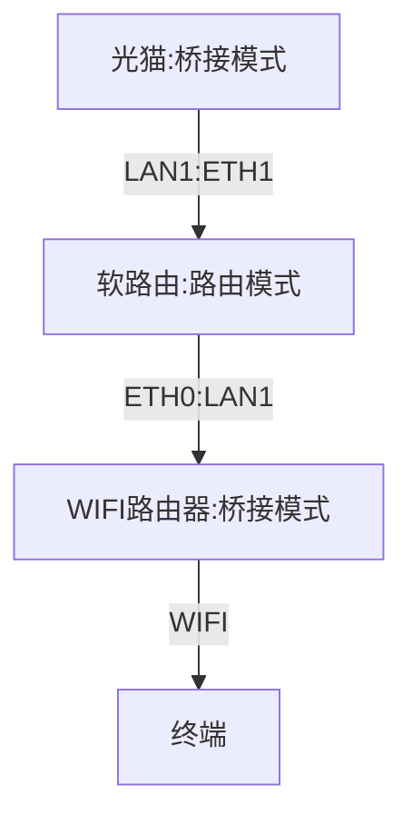
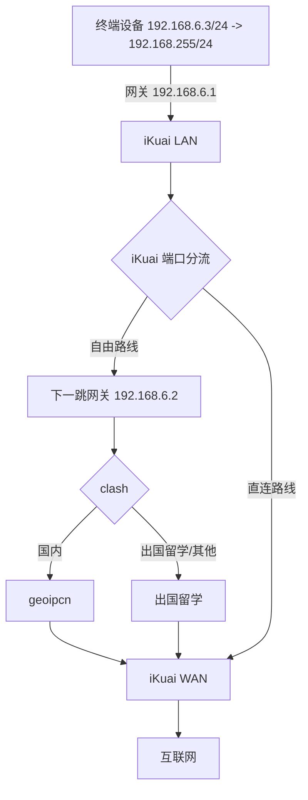
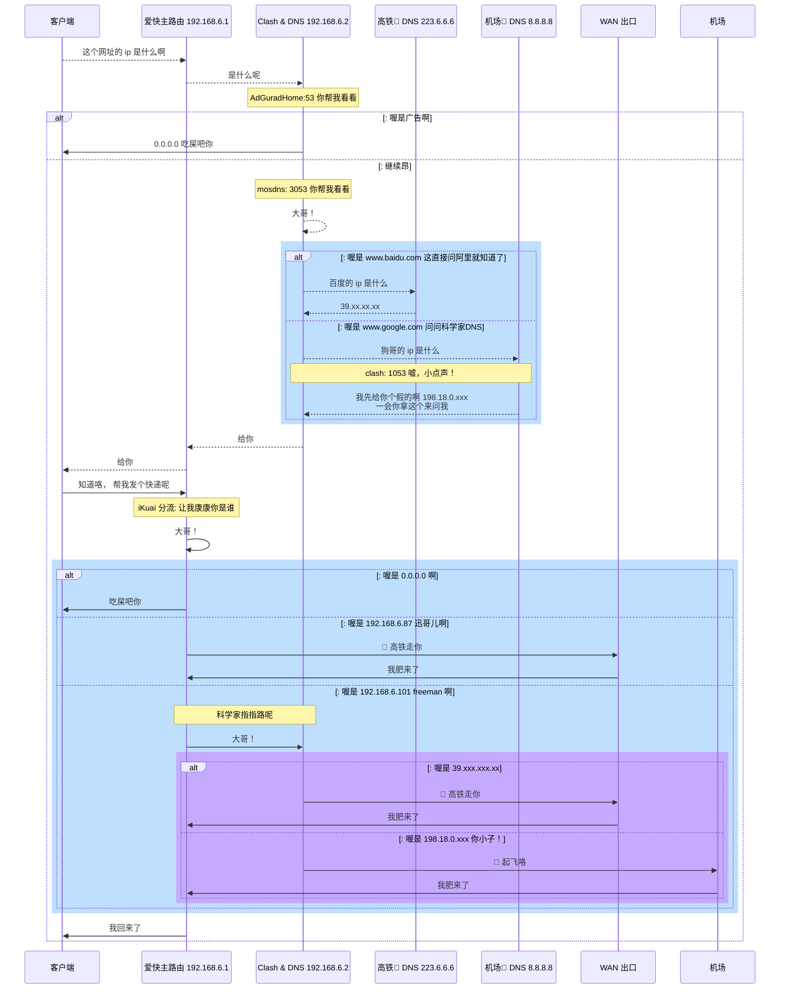

# BoomLab 整体架构

NAS × 软路由配置指北, 由 Proxmox VE 强力驱动.

## 硬件结构

:::tip 物理接口， ~~划线~~ 代表未使用

1.光猫: LAN1, ~~LAN2~~, ~~LAN3~~, ~~LAN4~~

2.软路由: ETH1, ETH2

3.WIFI 硬路由: WIFI, ~~LAN1~~, ~~LAN2~~, ~~LAN3~~, ~~LAN4~~, ~~WAN1~~
:::

| 名称    | 入口   | 出口   | 路由模式 |
| ------- | ------ | ------ | -------- |
| 光猫    | 光纤   | `LAN1` | 桥接     |
| 软路由  | `ETH1` | `ETH0` | 路由     |
| TP-Link | `LAN1` | `WIFI` | 桥接     |

## 虚拟机规划

众所周知， PVE 8.0 底层系统是 Debain 12， 所以我们的 LXC 容器都使用 Debain ~~并没有什么因果关系~~

同时， 防火墙配置靠 iKuai 所以 PVE 中的 数据中心/宿主机节点/LXC 全部防火墙都为禁用

| 名称   | 类型   | 说明                      |
| ------ | ------ | ------------------------- |
| pve    | 宿主机 | 母鸡                      |
| iKuai  | VM     | 小鸡:主路由               |
| clash  | LXC    | 小鸡:科学路由+DNS         |
| cloud  | LXC    | 文件分享 smb/sftpgo/alist |
| tv     | LXC    | 电视鸡                    |
| docker | LXC    | CT 套娃 docker 鸡         |
| bt     | LXC    | 下载鸡 xunlei/bt          |

## 分流策略

:::tip 分流策略

1. 自由路线

   1.1 For 小鸡们： 192.168.6.3 - 192.168.6.80

   1.2 自由路线 For DHCP： 192.168.6.100 - 192.168.6.200

2. 直连路线

   2.1: BT 下载鸡 192.168.6.81 - 192.168.6.99

   2.2 保留 IP 段: 192.168.6.200 - 192.168.6.255

:::

### 留学思路

### 留学详解

## 具体配置

### PVE 网桥配置

> 参考 [ahuacate/pve-host](https://github.com/ahuacate/pve-host#22-pve-host---dual-nic-pfsense-support)

| Linux Bridge   |                                  |                                  |
| -------------- | -------------------------------- | -------------------------------- |
| Name           | `vmbr0`                          | `vmbr1`                          |
| IPv4/CIDR      | `192.168.6.6/24`                 | 留白不填                         |
| Gateway (IPv4) | `192.168.6.1`                    | 留白不填                         |
| IPv6/CIDR      | 留白不填                         | 留白不填                         |
| Gateway (IPv6) | 留白不填                         | 留白不填                         |
| Autostart      | `√`                              | `√`                              |
| VLAN aware     | `√`                              | `√`                              |
| Bridge ports   | 填写你的网卡名称 (比如： enp1s0) | 填写你的网卡名称 (比如： enp2s0) |
| Comment        | `ETH0 as LAN`                    | `ETH1 as WAN`                    |
| MTU            | 1500                             | 1500                             |

### 路由配置一览

> 参考 [ahuacate/pve-homelab](https://github.com/ahuacate/pve-homelab#prerequisites)

重点注意 iKuai 虚拟机需要两张网卡， 跟 clash 虚拟机通过 iKuai **端口分流**实现 **网关互指**

| 名称  | 类型 | 网卡 Linux Bridge | IPv4/CIDR          | 网关                        | DNS          | 备注                                |
| ----- | ---- | ----------------- | ------------------ | --------------------------- | ------------ | ----------------------------------- |
| pve   | Host | `WAN`             | 留白不填           | 留白不填                    | -            | 母鸡                                |
| pve   | Host | `LAN`             | 192.168.6.6/24     | 192.168.6.1                 | 223.6.6.6    | 母鸡                                |
| clash | CT   | `LAN`             | **192.168.6.2/24** | **192.168.6.1**             | 使用主机设置 | 小鸡:科学路由                       |
| iKuai | VM   | `LAN`             | **192.168.6.1/24** | **192.168.6.2** by 端口分流 | 192.168.6.2  | 小鸡:主路由, ip 绑定在 iKuai 控制台 |
| iKuai | VM   | `WAN` PPPOE       | DHCP               | DHCP                        | DHCP         | 小鸡:主路由, 都是在管理界面配置     |

### 小鸡应用路由配置一览

小鸡们都是只需要配置一个网卡 LAN 就可以

| 名称   | 类型 | 网卡 Linux Bridge | IPv4/CIDR       | 网关        | IPv6          | DNS          | 备注                      |
| ------ | ---- | ----------------- | --------------- | ----------- | ------------- | ------------ | ------------------------- |
| cloud  | CT   | `LAN`             | 192.168.6.3/24  | 192.168.6.1 | 静态:留白不填 | 使用主机设置 | 网盘小鸡 smb/sftpgo/alist |
| tv     | CT   | `LAN`             | 192.168.6.4/24  | 192.168.6.1 | 静态:留白不填 | 使用主机设置 | 电视鸡                    |
| docker | CT   | `LAN`             | 192.168.6.5/24  | 192.168.6.1 | 静态:留白不填 | 使用主机设置 | CT 套娃 docker 鸡         |
| bt     | CT   | `LAN`             | 192.168.6.87/24 | 192.168.6.1 | 静态:留白不填 | 使用主机设置 | 下载鸡 xunlei/bt          |
