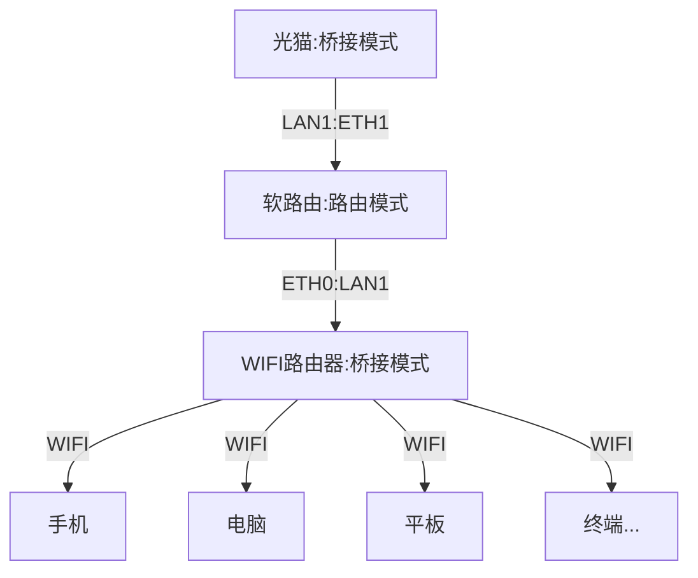

# BoomLab ::: NAS 「×」 软路由配置指北, 由 Proxmox VE 强力驱动.

本指南旨在记录个人软路由的一个折腾记录, 在给出尽可能详细的配置和步骤的同时, 尽量 **「授之以渔」** 解释原理, 方便给大家参考

> 本指南 **不是** 图文详解的指南, 硬件与配置不同, 应用需求不同, 需要根据自己情况灵活调整

> 本指南 **不保证** 零基础适用, 虽然有一些说明解释, 但是仍然需要能够理解一些 linux 命令行基础或 Google/ChatGpt 提问能力

BoomLab 是一个基于 嘤特尔 J6412 x86_64 的硬件配置而成的软路由 NAS 全家桶, 有以下特点:

| Proxmox VE 8.0 | 充分利用其虚拟化特性，提供卓越的性能和可靠性。 随意创建和回滚快照，轻松管理系统状态，确保安全和可控性。 |
| -------------- | ------------------------------------------------------------------------------------------------------- |
| 科学分流       | 整合 iKuai 和 ShellClash，提供流畅稳定丝滑自然的科学分流冲浪体验。                                      |
| 分层架构       | 采用 LXC 应用分层架构，有效隔离不同应用，便于灵活的拓展和定制，根据需求增减应用模块。                   |
| 热拔插 NAS     | 支持硬盘热拔插，灵活健壮的 NAS 服务                                                                     |

## 硬件概览

```sh
OS: Proxmox VE 8.0.3 x86_64
Host: EHL30 V1.0
Kernel: 6.2.16-3-pve
Uptime: 10 hours, 3 mins
CPU: Intel Celeron J6412 (4) @ 2.600GHz
GPU: Intel Elkhart Lake [UHD Graphics Gen11 16EU]
Memory: 2557MiB / 7777MiB
USB: 16TB 外挂硬盘
```

## 软件设计

**软路由核心应用**:

- iKuai 主路由: 简单好用的管理后台，优雅的分流配置
- LXC 旁路由： AdGuardHome 「×」 mosdns 「×」 ShellClash 自然丝滑的分流体验

**NAS 应用部分**:

> LXC alpine linux powered.

- 网盘小鸡： FTP/SFTP/WebDav/AList
- Docker 鸡： 套娃 docker
- 电视鸡：jellyfin 硬解
- 录像鸡：ffmpeg 录制摄像头视频
- 下载鸡：qBittorrent/NAS 迅雷
- 网关鸡: ddns-go/nginx/tailscale 导航兼外网访问

### 硬件拓扑

:::tip 物理接口， ~~划线~~ 代表未使用

1.光猫: LAN1, ~~LAN2~~, ~~LAN3~~, ~~LAN4~~

2.软路由: ETH1, ETH2

3.WIFI 硬路由: WIFI, ~~LAN1~~, ~~LAN2~~, ~~LAN3~~, ~~LAN4~~, ~~WAN1~~
:::

| 名称    | 入口   | 出口   | 路由模式 |
| ------- | ------ | ------ | -------- |
| 光猫    | 光纤   | `LAN1` | 桥接     |
| 软路由  | `ETH1` | `ETH0` | 路由     |
| TP-Link | `LAN1` | `WIFI` | 桥接     |



## 小结

在开始之前, 你可能需要先了解一下简单的网络和 linux 的基础知识

## 参考文档

- [基于 DNS 的内网透明代理分流方案](https://songchenwen.com/tproxy-split-by-dns)
- [ahuacate/pve-host](https://github.com/ahuacate/pve-host#22-pve-host---dual-nic-pfsense-support)
- [ahuacate/pve-homelab](https://github.com/ahuacate/pve-homelab#prerequisites)
- [tteck/Proxmox](https://github.com/tteck/Proxmox)
- [DIY Linux Router Part 3: PPPOE and Routing](https://www.sherbers.de/diy-linux-router-part-3-pppoe-and-routing/)
- [debian 搭建简易路由笔记（未完成外网部分）](https://www.jianshu.com/p/d7a070ee0378)
- [nftables 初体验](https://owent.net/2020/2002.html)
- [LXC 直通核显](https://northes.io/posts/pve/lxc-dri/)
- [Proxmox LXC 挂载目录及权限设置](https://www.haiyun.me/archives/1419.html)
- [配置 Debian 路由器双 WAN 接入 ](https://blog.ismisv.com/2022/11/dual-wan-internet-access/)
- [使用 Debian 作为路由器](https://blog.bling.moe/post/3/)
- [Debian 服务器变成软路由--Part1](https://www.bilibili.com/read/cv16214037/)
