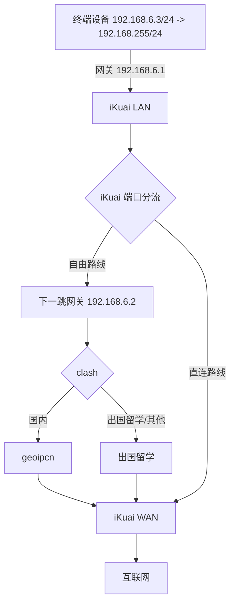
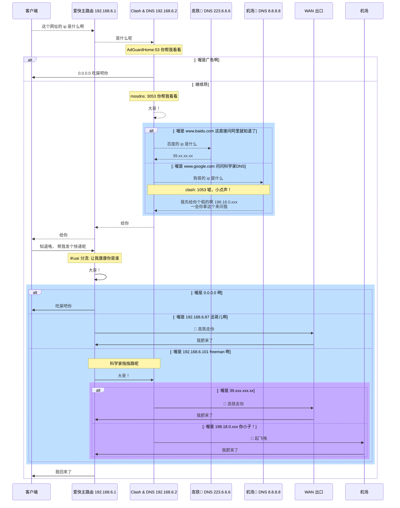

# 网络基础与科学解释

## IP, 网关，DHCP 和 DNS

大多数情况下，设备的 IP 都是通过 DHCP 服务器自动配置的， 但在处理 PVE/iKuai 安装之后首次进入管理界面等场景下
都是需要手动配置 IP, 使设备能够访问管理界面

### IP 地址,子网掩码和 CIDR 表示法

这里偏实用， 就不讲太详细，只谈 IPv4. 举几个例子来说明一下

- 常见 ip 地址 `192.168.6.1` 通过点分割的 4 个 10 进制数来表示，取值范围 0-255， 这个范围的来由是， ip 地址本质是上是 **32**位二进制来表示的， 通过`.` 分割未 4 个 10 进制来表示是为了好记， 而 32/4=8 每个范围是 8 个二进制位置， 最大值就是 255

- `子网掩码`: `192.168.6.x/255.255.255.0` 这个表明 最后 8 位二进制， 也就是最后一段 十进制位置 `x` 的 ip 段归属与**同一个子网**, 同理 `192.168.y.x/255.255.0.0` 则表示 `y.x` 范围内同属于一个子网, 掩码的 0 越多， 能分配的 ip 地址越多，更多可以百度一下 ABC 类网络划分，这里我们仍然不深究

- `CIDR` 表示法： 上面提到， 子网掩码中末尾 `0` 的数量表明了子网的范围， 这个范围其实本质上是 二进制 `0` 的数量， `255.255.255.0` 的二进制表示法是 `11111111 11111111 11111111 00000000` ； 其中 `1` 的数量是 `24` 个, `255.255.0.0` 的二进制表示法是 `11111111 11111111 00000000 00000000` 其中 `1` 的数量是 `16` 个, 所以就有了子网掩码的简化表示法 `192.168.6.x/24` 或 `192.168.x.x/16`

不管是子网掩码还是 CIDR 表示法， 都是在指明一个子网范围， `192.168.6.0/24` 就意味着 `192.168.6.0 - 192.168.6.255` 共计 255 个可用 ip， 对于正常家用来说足够了

- `网关`：是指你的设备流量会从哪里出去， 关口嘛； 一般来说就是路由器设备的 IP 地址， 因为你的流量要从路由器出去

- `静态 IP`：
  这时候如果我们有一台电脑链接到了路由器， 手动方式我们该如何访问路由器的管理后台呢？

1. 确定路由器 IP 和 子网掩码， 比如常见的 `192.168.0.1/24`
2. 手动设置设备 IP `192.168.0.100` 子网掩码 `255.255.255.0` 网关 `192.168.0.1`
3. 打开浏览器输入网关地址`192.168.0.1`

::: tip 使用场景
经常用来确认 LAN 口: 不确定那个是 LAN 口的时候， 就可以通过手动设置静态地址， 然后插拔到各个网口上测试， 哪个能通那个就是 LAN 口
:::

比方说小米手机的 WIFI 设置

假如我恰好富可敌国， 家里有 100 台手机， 总不能一个个的去设备上设置吧， 所以这个时候就需要

- `DHCP`: 自动分配 IP 和 DNS，由路由器主动下发一个 IP 和 DNS 给到设备， 精准而优雅， 免去了一个个手动配置的麻烦,
  这也是所有硬路由的默认配置

- `DNS`： 流量出去都是根据 IP 来寻址的， 而域名 `www.baidu.com` 只是为了方便人类记忆， 那么， 怎么把域名转换成 IP 地址呢？ 这个时候就需要一个 DNS 服务器， 把 `www.baidu.com` 转换为 `39.156.66.14`, 所以 DNS **并不一定要跟** 网关`一致`

## 科学核心

有了以上基础, 应该比较容易理解我们的科学冲浪的设计了, 看不懂也不要紧, 后面实践中可以随时回头来看加深印象.

:::tip 分流策略

1. 自由路线 192.168.6.3 - 192.168.6.200

2. 直连路线 192.168.6.201 - 192.168.6.255

:::

### 祭出网络拓扑

### 详细图解

[查看大图](http://mermaid-plugin.tooltag.cn/view/#eyJjb2RlIjoic2VxdWVuY2VEaWFncmFtXG4gIHBhcnRpY2lwYW50IEEgYXMg5a6i5oi356uvXG4gIHBhcnRpY2lwYW50IEIgYXMg54ix5b-r5Li76Lev55SxIDE5Mi4xNjguNi4xXG4gIHBhcnRpY2lwYW50IEMgYXMgQ2xhc2ggJiBETlMgMTkyLjE2OC42LjJcbiAgcGFydGljaXBhbnQgRjEgYXMg6auY6ZOB8J-ahCBETlMgMjIzLjYuNi42XG4gIHBhcnRpY2lwYW50IEYyIGFzIOacuuWcuvCfm6sgRE5TIDguOC44LjhcbiAgcGFydGljaXBhbnQgRSBhcyBXQU4g5Ye65Y-jXG4gIHBhcnRpY2lwYW50IEQgYXMg5py65Zy6XG4gIEEgLS0-PiBCOiDov5nkuKrnvZHlnYDnmoQgaXAg5piv5LuA5LmI5ZWKXG4gIEIgLS0-PiBDOiDmmK_ku4DkuYjlkaJcbiAgTm90ZSBvdmVyIEMsQzogQWRHdXJhZEhvbWU6NTMg5L2g5biu5oiR55yL55yLXG4gIGFsdDog5ZaU5piv5bm_5ZGK5ZWKXG4gICAgQyAtPj4gQTogMC4wLjAuMCDlkIPlsY7lkKfkvaBcbiAgZWxzZTog57un57ut5piCXG4gIE5vdGUgb3ZlciBDLEM6IG1vc2RuczogMzA1MyDkvaDluK7miJHnnIvnnItcbiAgQyAtLT4-IEM6IOWkp-WTpe-8gVxuICByZWN0IHJnYigxOTEsIDIyMywgMjU1KVxuICAgIGFsdDog5ZaU5pivIHd3dy5iYWlkdS5jb20g6L-Z55u05o6l6Zeu6Zi_6YeM5bCx55-l6YGT5LqGXG4gICAgICAgIEMgLS0-PiBGMTog55m-5bqm55qEIGlwIOaYr-S7gOS5iFxuICAgICAgICBGMSAtLT4-IEM6IDM5Lnh4Lnh4Lnh4XG4gICAgZWxzZTog5ZaU5pivIHd3dy5nb29nbGUuY29tIOmXrumXruenkeWtpuWutkROU1xuICAgICAgICBDIC0tPj4gRjI6IOeLl-WTpeeahCBpcCDmmK_ku4DkuYhcbiAgICAgICAgTm90ZSBvdmVyIEYyLEM6IGNsYXNoOiAxMDUzIOWYmO-8jOWwj-eCueWjsO-8gVxuICAgICAgICBGMiAtLT4-IEM6ICDmiJHlhYjnu5nkvaDkuKrlgYfnmoTllYogMTk4LjE4LjAueHh4IDxici8-IOS4gOS8muS9oOaLv-i_meS4quadpemXruaIkVxuICAgIGVuZFxuICBlbmRcbiAgQyAtLT4-IEI6IOe7meS9oFxuICBCIC0tPj4gQTog57uZ5L2gXG4gIEEgLT4-IEI6IOefpemBk-WSr--8jCDluK7miJHlj5HkuKrlv6vpgJLlkaJcbiAgTm90ZSBvdmVyIEIsQjogaUt1YWkg5YiG5rWBOiDorqnmiJHlurflurfkvaDmmK_osIFcbiAgQiAtPj4gQjog5aSn5ZOl77yBXG4gIHJlY3QgcmdiKDE5MSwgMjIzLCAyNTUpXG4gICAgYWx0OiDllpTmmK8gMC4wLjAuMCDllYpcbiAgICAgICAgQiAtPj4gQTog5ZCD5bGO5ZCn5L2gXG4gICAgZWxzZTog5ZaU5pivIDE5Mi4xNjguNi44NyDov4Xlk6XlhL_llYpcbiAgICAgICAgQiAtPj4gRTog8J-ahCDpq5jpk4HotbDkvaBcbiAgICAgICAgRSAtPj4gQjog5oiR6IKl5p2l5LqGXG4gICAgZWxzZTog5ZaU5pivIDE5Mi4xNjguNi4xMDEgZnJlZW1hbiDllYpcbiAgICAgICAgTm90ZSBvdmVyIEIsQzog56eR5a2m5a625oyH5oyH6Lev5ZGiXG4gICAgICAgIEIgLT4-IEM6IOWkp-WTpe-8gVxuICAgICAgICByZWN0IHJnYigyMDAsIDE1MCwgMjU1LCAuNylcbiAgICAgICAgICBhbHQ6IOWWlOaYryAzOS54eHgueHh4Lnh4XG4gICAgICAgICAgICBDIC0-PiBFOiDwn5qEIOmrmOmTgei1sOS9oFxuICAgICAgICAgICAgRSAtPj4gQjogIOaIkeiCpeadpeS6hlxuICAgICAgICAgIGVsc2U6IOWWlOaYryAxOTguMTguMC54eHgg5L2g5bCP5a2Q77yBXG4gICAgICAgICAgICBDIC0-PiBEOiDwn5urIOi1t-mjnuWSr1xuICAgICAgICAgICAgRCAtPj4gQjog5oiR6IKl5p2l5LqGXG4gICAgICAgICAgZW5kXG4gICAgICAgIGVuZFxuICAgIGVuZFxuICBlbmRcbiAgQiAtPj4gQTog5oiR5Zue5p2l5LqGXG4gIGVuZFxuIiwibWVybWFpZCI6IntcbiAgXCJ0aGVtZVwiOiBcImRlZmF1bHRcIlxufSIsInVwZGF0ZUVkaXRvciI6dHJ1ZSwiYXV0b1N5bmMiOnRydWUsInVwZGF0ZURpYWdyYW0iOnRydWV9)

## 小结

对与网络有了一定的基础印象之后, 下一步我们开始熟悉常用的 linux 命令
