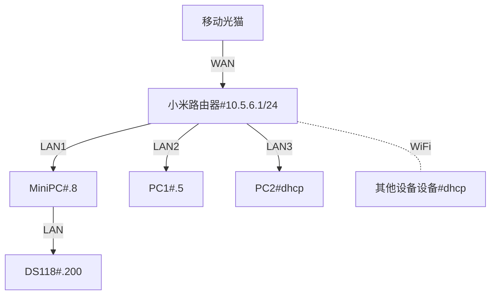
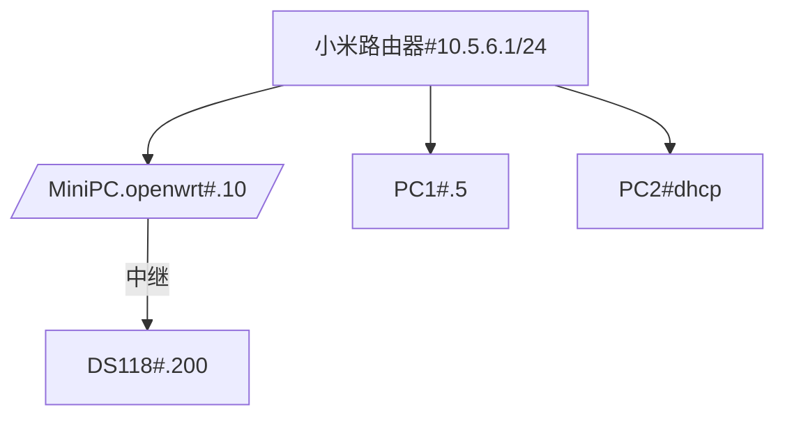

---
next:
  text: '小米路由器'
  link: '/lab/router'
---
# 0x00 写在前面

网络设备更新了一下主路由, 整体配置简化了很多; 原来配置已经不适用, 重新配置过程中, 发现用到很多之前笔记,
特此更新, 以备不时之需. 如果有帮助到你的话, 那真是再好不过了

## 设备列表

|设备名称|网口|备注|
|---|---|---|
|移动光猫|1GbE × 4|光猫改桥接, 直接路由器中拨号|
|小米路由器|2.5GbE × 4|Xiaomi BE6500 PRO|
|MiniPC|2.5GbE × 2|PVE 宿主机|
|DS118 |1GbE × 1|WD My Home Cloud 硬改黑裙|
|PC1|1GbE × 1||
|PC2|2.5GbE × 1||

## 网络拓扑

> 因为路由器网口只有4个, 所以中间使用了 MiniPC 在 PVE 环境中安装了一个 openwrt, 作为中继路由使用

> 先前啰嗦过的[基础的网络知识](/archived/0x02basenet.md)

物理网线连接

网络逻辑连接

固定IP表

|设备|IP|备注|
|---|---|---|
|小米路由器|10.5.6.1/24||
|MiniPC|10.5.6.8/24||
|MiniPC#openwrt|10.5.6.10/24|虚拟机,中继路由器|
|DS118|10.5.6.200/24||
|PC1|10.5.6.5/24||
|其他设备|10.5.6.86 ~ 10.5.6.186|DHCP自动分配|

## 小结

接下来, 从[路由器](/lab/router)开始折腾之旅吧